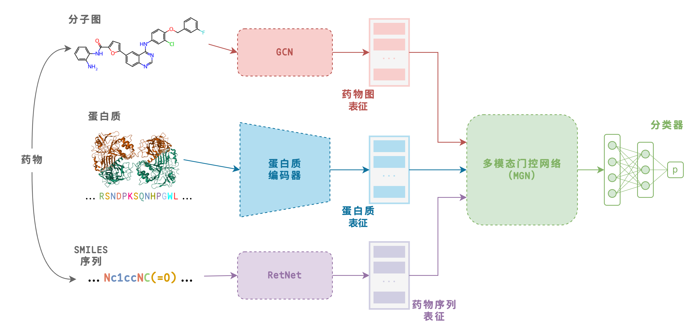

<center>

# 使用跨序列文本模态对比学习预训练的DTI预测方法

`武汉大学2025届本科毕业设计`

### 摘要

</center>


药物靶点相互作用预测可以促进并加速药物发现和药物重定位，在药物虚拟筛选中具有十分重要的地位。现有的基于深度学习的药物靶点相互作用预测技术已经拥有了不错的表现，并且随着对比学习、跨模态表征提取等方法的应用，这一领域已经取得不错的成效。但是已有的方法都很少考虑利用蛋白质文本模态的数据，这种模态的数据信息量大、容易获取、可读性好，是优质的蛋白质表征提取的信息来源；并且随着生物语言模型的开发，蛋白质文本模态的数据可以依此类模型提取表征，这为文本模态数据应用到药物靶点相互作用预测技术上提供了技术支撑。本研究基于这些现状提出了一个新的方法——使用序列文本对比学习预训练的药物靶点相互作用预测（Sequence-Text Contrastive learning for Drug Target Interaction prediction，STCDTI）。STCDTI使用跨序列和文本模态的对比学习对蛋白质编码器进行预训练，然后冻结蛋白质编码器参数在下游DTI预测任务上进行微调。在下游训练过程中，本研究对STCDTI在四个不同的场景下的性能进行了评估，并与基准模型进行了比较。下游训练使用了数据分布不同的四个数据集（BioSNAP、BindingDB、Davis、KIBA），通过AUROC、AUPRC、F1得分三个指标量化模型表现，结果表明STCDTI在药物靶点相互作用预测上达到了先进水平，并展现出了对比学习和蛋白质文本模态的应用潜力。

## STCDTI 框架

<center>



</center>

本研究使用的 DTI 模型框架遵循 [MGNDTI](https://github.com/plhhnu/MGNDTI)，预训练方法遵循 [ProtST](https://github.com/DeepGraphLearning/ProtST)。


## 环境配置

建议使用 Anaconda 管理虚拟环境，具体的环境信息如下：

```
# Name                    Version                   Build  Channel
_libgcc_mutex             0.1                        main  
_openmp_mutex             5.1                       1_gnu  
asttokens                 3.0.0              pyhd8ed1ab_1    conda-forge
blas                      1.0                         mkl  
bottleneck                1.4.2            py39ha9d4c09_0  
brotli-python             1.0.9            py39h6a678d5_9  
ca-certificates           2025.2.25            h06a4308_0  
certifi                   2025.1.31        py39h06a4308_0  
charset-normalizer        3.4.1                    pypi_0    pypi
cloudpickle               3.1.1                    pypi_0    pypi
comm                      0.2.2              pyhd8ed1ab_1    conda-forge
contourpy                 1.3.0                    pypi_0    pypi
cuda-cudart               11.7.99                       0    nvidia
cuda-cupti                11.7.101                      0    nvidia
cuda-libraries            11.7.1                        0    nvidia
cuda-nvrtc                11.7.99                       0    nvidia
cuda-nvtx                 11.7.91                       0    nvidia
cuda-runtime              11.7.1                        0    nvidia
cuda-version              12.8                          3    nvidia
cycler                    0.12.1                   pypi_0    pypi
debugpy                   1.8.13           py39hf88036b_0    conda-forge
decorator                 5.2.1              pyhd8ed1ab_0    conda-forge
dgl-cuda11.7              0.9.1post1               py39_0    dglteam
dgllife                   0.3.2              pyhd8ed1ab_1    conda-forge
easydict                  1.13                     pypi_0    pypi
einops                    0.8.1                    pypi_0    pypi
exceptiongroup            1.2.2              pyhd8ed1ab_1    conda-forge
executing                 2.1.0              pyhd8ed1ab_1    conda-forge
fair-esm                  2.0.0                    pypi_0    pypi
filelock                  3.13.1           py39h06a4308_0  
fonttools                 4.56.0                   pypi_0    pypi
fsspec                    2025.3.2                 pypi_0    pypi
future                    1.0.0            py39h06a4308_0  
gmp                       6.3.0                h6a678d5_0  
gmpy2                     2.2.1            py39h5eee18b_0  
huggingface-hub           0.30.1                   pypi_0    pypi
hyperopt                  0.2.7              pyhd8ed1ab_1    conda-forge
idna                      3.10                     pypi_0    pypi
importlib-metadata        8.6.1              pyha770c72_0    conda-forge
importlib-resources       6.5.2                    pypi_0    pypi
intel-cmplr-lib-ur        2024.2.1                 pypi_0    pypi
intel-openmp              2024.2.1                 pypi_0    pypi
ipykernel                 6.29.5             pyh3099207_0    conda-forge
ipython                   8.18.1             pyh707e725_3    conda-forge
jedi                      0.19.2             pyhd8ed1ab_1    conda-forge
jinja2                    3.1.6            py39h06a4308_0  
joblib                    1.4.2            py39h06a4308_0  
jupyter_client            8.6.3              pyhd8ed1ab_1    conda-forge
jupyter_core              5.7.2              pyh31011fe_1    conda-forge
kiwisolver                1.4.7                    pypi_0    pypi
krb5                      1.21.3               h143b758_0  
ld_impl_linux-64          2.40                 h12ee557_0  
libblas                   3.8.0           11_h86c2bf4_netlib    conda-forge
libcblas                  3.8.0           11_h86c2bf4_netlib    conda-forge
libcublas                 11.10.3.66                    0    nvidia
libcufft                  10.7.2.124           h4fbf590_0    nvidia
libcufile                 1.13.1.3                      0    nvidia
libcurand                 10.3.9.90                     0    nvidia
libcusolver               11.4.0.1                      0    nvidia
libcusparse               11.7.4.91                     0    nvidia
libedit                   3.1.20230828         h5eee18b_0  
libffi                    3.4.4                h6a678d5_1  
libgcc                    14.2.0               h767d61c_2    conda-forge
libgcc-ng                 14.2.0               h69a702a_2    conda-forge
libgfortran-ng            11.2.0               h00389a5_1  
libgfortran5              11.2.0               h1234567_1  
libgomp                   14.2.0               h767d61c_2    conda-forge
liblapack                 3.8.0           11_h86c2bf4_netlib    conda-forge
libnpp                    11.7.4.75                     0    nvidia
libnvjpeg                 11.8.0.2                      0    nvidia
libsodium                 1.0.20               h4ab18f5_0    conda-forge
libstdcxx                 14.2.0               h8f9b012_2    conda-forge
libstdcxx-ng              11.2.0               h1234567_1  
lmdb                      1.6.2                    pypi_0    pypi
markupsafe                3.0.2            py39h5eee18b_0  
matplotlib                3.9.4                    pypi_0    pypi
matplotlib-inline         0.1.7              pyhd8ed1ab_1    conda-forge
mkl                       2024.0.0                 pypi_0    pypi
mpc                       1.3.1                h5eee18b_0  
mpfr                      4.2.1                h5eee18b_0  
mpmath                    1.3.0            py39h06a4308_0  
ncurses                   6.4                  h6a678d5_0  
nest-asyncio              1.6.0              pyhd8ed1ab_1    conda-forge
networkx                  3.2.1            py39h06a4308_0  
ninja                     1.11.1.4                 pypi_0    pypi
numexpr                   2.7.3            py39hde0f152_1    conda-forge
numpy                     1.24.4                   pypi_0    pypi
nvidia-cublas-cu11        11.10.3.66               pypi_0    pypi
nvidia-cublas-cu12        12.4.5.8                 pypi_0    pypi
nvidia-cuda-cupti-cu12    12.4.127                 pypi_0    pypi
nvidia-cuda-nvrtc-cu11    11.7.99                  pypi_0    pypi
nvidia-cuda-nvrtc-cu12    12.4.127                 pypi_0    pypi
nvidia-cuda-runtime-cu11  11.7.99                  pypi_0    pypi
nvidia-cuda-runtime-cu12  12.4.127                 pypi_0    pypi
nvidia-cudnn-cu11         8.5.0.96                 pypi_0    pypi
nvidia-cudnn-cu12         9.1.0.70                 pypi_0    pypi
nvidia-cufft-cu12         11.2.1.3                 pypi_0    pypi
nvidia-curand-cu12        10.3.5.147               pypi_0    pypi
nvidia-cusolver-cu12      11.6.1.9                 pypi_0    pypi
nvidia-cusparse-cu12      12.3.1.170               pypi_0    pypi
nvidia-cusparselt-cu12    0.6.2                    pypi_0    pypi
nvidia-nccl-cu12          2.21.5                   pypi_0    pypi
nvidia-nvjitlink-cu12     12.4.127                 pypi_0    pypi
nvidia-nvtx-cu12          12.4.127                 pypi_0    pypi
openssl                   3.4.1                h7b32b05_0    conda-forge
packaging                 24.2               pyhd8ed1ab_2    conda-forge
pandas                    2.2.3                    pypi_0    pypi
parso                     0.8.4              pyhd8ed1ab_1    conda-forge
pexpect                   4.9.0              pyhd8ed1ab_1    conda-forge
pickleshare               0.7.5           pyhd8ed1ab_1004    conda-forge
pillow                    11.1.0                   pypi_0    pypi
pip                       25.0             py39h06a4308_0  
platformdirs              4.3.7              pyh29332c3_0    conda-forge
portalocker               3.1.1                    pypi_0    pypi
prettytable               3.16.0                   pypi_0    pypi
prompt-toolkit            3.0.50             pyha770c72_0    conda-forge
psutil                    7.0.0            py39h8cd3c5a_0    conda-forge
ptyprocess                0.7.0              pyhd8ed1ab_1    conda-forge
pure_eval                 0.2.3              pyhd8ed1ab_1    conda-forge
py4j                      0.10.9.9                 pypi_0    pypi
pygments                  2.19.1             pyhd8ed1ab_0    conda-forge
pyparsing                 3.2.3                    pypi_0    pypi
pysocks                   1.7.1            py39h06a4308_0  
python                    3.9.21               he870216_1  
python-dateutil           2.9.0.post0        pyhff2d567_1    conda-forge
python-tzdata             2023.3             pyhd3eb1b0_0  
python_abi                3.9                      2_cp39    conda-forge
pytorch-cuda              11.7                 h778d358_5    pytorch
pytorch-mutex             1.0                        cuda    pytorch
pytz                      2025.2                   pypi_0    pypi
pyyaml                    6.0.2                    pypi_0    pypi
pyzmq                     26.3.0           py39h4e4fb57_0    conda-forge
rdkit-pypi                2022.9.5                 pypi_0    pypi
readline                  8.2                  h5eee18b_0  
regex                     2024.11.6                pypi_0    pypi
requests                  2.32.3           py39h06a4308_1  
safetensors               0.5.3                    pypi_0    pypi
scikit-learn              1.6.1            py39h6a678d5_0  
scipy                     1.13.1                   pypi_0    pypi
setuptools                75.8.0           py39h06a4308_0  
six                       1.17.0             pyhd8ed1ab_0    conda-forge
sqlite                    3.45.3               h5eee18b_0  
stack_data                0.6.3              pyhd8ed1ab_1    conda-forge
sympy                     1.13.1                   pypi_0    pypi
tbb                       2021.13.1                pypi_0    pypi
tbb-devel                 2022.0.0             hdb19cb5_0  
threadpoolctl             3.6.0                    pypi_0    pypi
tk                        8.6.14               h39e8969_0  
tokenizers                0.13.3                   pypi_0    pypi
torch                     1.13.1                   pypi_0    pypi
torch-cluster             1.6.3                    pypi_0    pypi
torch-scatter             2.1.2                    pypi_0    pypi
torchaudio                0.13.1+cu117             pypi_0    pypi
torchdata                 0.5.1                    pypi_0    pypi
torchdrug                 0.2.0.post1              pypi_0    pypi
torchvision               0.14.1+cu117             pypi_0    pypi
tornado                   6.4.2            py39h8cd3c5a_0    conda-forge
tqdm                      4.67.1           py39h2f386ee_0  
traitlets                 5.14.3             pyhd8ed1ab_1    conda-forge
transformers              4.26.1                   pypi_0    pypi
triton                    3.2.0                    pypi_0    pypi
typing_extensions         4.12.2           py39h06a4308_0  
tzdata                    2025.2                   pypi_0    pypi
urllib3                   2.3.0            py39h06a4308_0  
wcwidth                   0.2.13             pyhd8ed1ab_1    conda-forge
wheel                     0.45.1           py39h06a4308_0  
xz                        5.6.4                h5eee18b_1  
yacs                      0.1.8                    pypi_0    pypi
zeromq                    4.3.5                h3b0a872_7    conda-forge
zipp                      3.21.0             pyhd8ed1ab_1    conda-forge
zlib                      1.2.13               h5eee18b_1  
```

## 预训练

预训练配置文件保存在 configs 文件夹当中，`pretrain_hrnn.yaml` 用于`ProtSTMMP`方法对`HRNN`进行预训练。
你可以根据需要自行修改配置文件。

在预训练之前，你需要下载预训练数据集，这个数据集可以在下面这个网址中找到：

    https://miladeepgraphlearningproteindata.s3.us-east-2.amazonaws.com/uniprotdata/uniprot_sprot_filtered.tsv

然后你可以使用下面的命令运行预训练：

```bash
python run_pretrain.py \
    -c configs/pretrain_hrnn.yaml \
    --seed 2025 \
    --save_step 10 \
    --dataset_path /path/to/dataset.tsv
```

## 下游DTI预测微调

四个数据集及其四个场景的划分已经打包压缩在了`datasets_4splits.tar.xz`当中，请将其解压到合适的路径。

训练的配置文件保存在 configs 文件夹当中，使用 `DTI_task.yaml` 作为 DTI 任务的配置文件。你可以根据需要自行修改配置文件。

使用下面的命令可以进行DTI预测微调：

```bash
python run_DTI_task.py \
    --config configs/DTI_task.yaml \
    --data_path /path/to/datasets_4splits \
    --data [BioSNAP;BindingDB;Davis;KIBA] \
    --model_epoch_name STC_HRNN \
    -p /pretrained/protein/encoder/HRNN \
    --seed 2025 \
    --cuda_id 0
```


